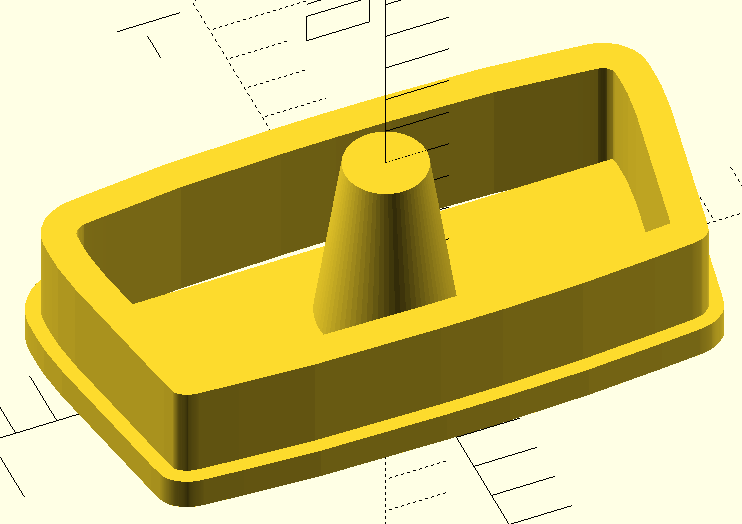
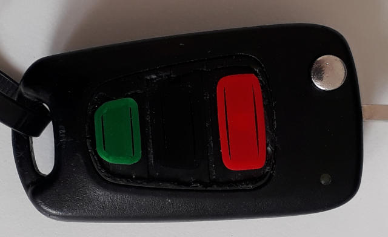

# Replacement for rubber mat on Hyundai i30 car key

This is a 3d-printable model for replacement buttons for the Hyundai i30
carkey rubber mat. This rubber mat seems to easily crumble away leaving the
microswitches below almost inaccessible.

The keys are a pretty tight fit, intentionally to make them remain in place
without the need for glueing. If necessary they can be cut/sanded a bit at
the bottom, or the model can be scaled a percent or so depending on
3D-printer and settings used.

License: GPL, version 2 or any later version. See the file COPYING.
